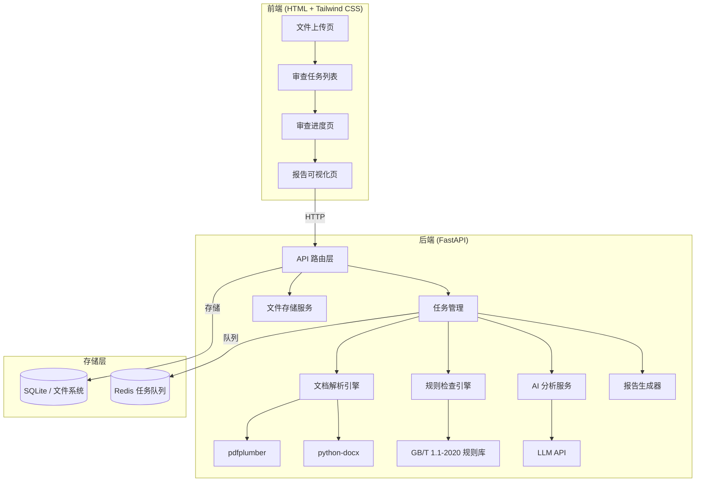

## 产品概述

一个基于 Web 的国家标准（GB/T、GB）初稿智能审查系统，用户通过浏览器上传已发布的参考标准文件（PDF/Word）和待审初稿（PDF/Word），系统自动进行多维度审查并生成可视化审查报告。

## 核心功能

- **格式合规性检查**：依据 GB/T 1.1-2020 规范，检查章节结构、编号规则、标题层级、排版格式（字体字号、段落间距）等是否符合标准起草规则
- **术语一致性审查**：提取初稿和参考标准中的术语，检测术语使用是否与参考标准一致，识别未定义或定义冲突的术语
- **内容完整性检查**：对比参考标准的章节结构，检查初稿是否缺少必要章节（如范围、规范性引用文件、术语定义、技术要求等）
- **条款语义对比分析**：基于 AI 大模型，对初稿与参考标准的对应条款进行语义级对比，识别表述差异、遗漏或矛盾之处
- **审查报告自动生成**：生成结构化的 HTML 可视化审查报告，包含问题汇总统计、逐项问题标注、改进建议，支持导出为 Word 文档

## 系统流程

1. 用户上传参考标准文件（已发布 GB 标准）建立参考标准库
2. 用户上传待审初稿并选择对应的参考标准
3. 系统解析文档，提取结构、术语、条款内容
4. 执行格式检查、完整性检查、术语对比、语义分析
5. 生成并展示审查报告，支持在线查看和导出

## 技术栈选择

- **后端框架**：Python + FastAPI（文档解析与 AI 分析能力强）
- **前端**：HTML + Tailwind CSS + 原生 JavaScript（轻量 SPA，无需复杂框架）
- **文档解析**：python-docx（Word 解析）、pdfplumber（PDF 文本提取）、python-pptx（如需）
- **AI 语义分析**：调用大模型 API（OpenAI 兼容接口，支持 DeepSeek/通义千问等国内模型）
- **报告生成**：Jinja2 模板生成 HTML 报告 + python-docx 导出 Word
- **任务队列**：Celery + Redis（处理耗时的文档解析和 AI 分析任务）

## 实现方案

### 整体策略

采用前后端分离架构，后端负责文档解析引擎、规则检查引擎和 AI 分析服务，前端提供文件上传、审查进度展示和报告可视化。系统分为两个阶段处理：第一阶段为基于规则的确定性检查（格式、结构、术语），第二阶段为基于 LLM 的语义分析（条款对比、改进建议）。

### 关键技术决策

- **文档解析采用分层策略**：Word 文件使用 python-docx 获取结构化 XML（段落样式、标题层级、列表），PDF 使用 pdfplumber 提取文本后通过正则和启发式规则重建文档结构。优先推荐 Word 格式以获得更精准的结构解析。
- **GB/T 1.1-2020 规则内置为配置化检查清单**：将标准中关于章节顺序、编号规则、标题格式等规则抽象为可配置的检查项 YAML 文件，便于后续扩展其他标准类型的规则。
- **语义分析采用 prompt engineering + 分块对比**：将参考标准和初稿按章节分块，构建结构化 prompt 逐段对比，避免超 token 限制，同时通过章节对齐确保对比的准确性。
- **前端采用文件上传 + 进度轮询 + 报告渲染**：上传后返回审查任务 ID，前端轮询任务状态，完成后加载结构化报告数据渲染可视化页面。

### 性能与可靠性

- 文档解析和 AI 调用为异步任务，通过 Celery 队列处理，避免阻塞请求
- 大文件上传限制 50MB，解析超时设置 120 秒
- AI 调用设置重试机制（最多 3 次，指数退避）
- 报告数据持久化存储，支持历史记录查询

### 架构设计



### 数据流

用户上传文件 -> FastAPI 保存文件 -> 创建 Celery 异步任务 -> 文档解析引擎提取结构化数据 -> 规则检查引擎执行格式/完整性/术语检查 -> AI 分析服务执行条款语义对比 -> 汇总结果 -> 报告生成器生成 HTML + Word -> 前端轮询获取结果并渲染

## 实现要点

- 开发环境优先使用 SQLite，生产环境可切换为 PostgreSQL
- 参考标准库按文件存储在本地 `data/standards/` 目录，元信息存入数据库
- 审查结果以 JSON 结构化存储，便于前端渲染和报告生成
- LLM API 配置通过环境变量管理，支持灵活切换模型提供商

## 目录结构

```
c:/Users/dell/WorkBuddy/Claw/
├── backend/
│   ├── main.py                    # [NEW] FastAPI 应用入口，注册路由和 CORS 配置
│   ├── config.py                  # [NEW] 配置管理（LLM API、存储路径、上传限制等）
│   ├── requirements.txt           # [NEW] Python 依赖清单
│   ├── parsers/
│   │   ├── __init__.py            # [NEW] 解析器模块初始化
│   │   ├── base.py                # [NEW] 文档解析器基类，定义统一接口（extract_structure, extract_terms, extract_clauses）
│   │   ├── docx_parser.py         # [NEW] Word 文档解析器，基于 python-docx 提取标题层级、段落、术语表
│   │   └── pdf_parser.py          # [NEW] PDF 文档解析器，基于 pdfplumber 提取文本并通过规则重建结构
│   ├── checkers/
│   │   ├── __init__.py            # [NEW] 检查器模块初始化
│   │   ├── base.py                # [NEW] 检查器基类，定义 check() 接口和检查结果数据结构
│   │   ├── format_checker.py      # [NEW] 格式合规性检查器，依据规则库检查章节编号、标题格式等
│   │   ├── completeness_checker.py # [NEW] 内容完整性检查器，对比参考标准章节结构
│   │   └── terminology_checker.py # [NEW] 术语一致性检查器，提取对比术语使用
│   ├── rules/
│   │   ├── gbt_1_1_2020.yaml     # [NEW] GB/T 1.1-2020 格式规则配置（章节顺序、编号模式等）
│   │   └── base_rules.yaml        # [NEW] 通用检查规则（基础章节要求等）
│   ├── services/
│   │   ├── __init__.py            # [NEW] 服务模块初始化
│   │   ├── review_service.py      # [NEW] 审查编排服务，协调各检查器和 AI 分析的执行流程
│   │   ├── ai_service.py          # [NEW] LLM API 调用服务，prompt 构建、分块对比、结果解析
│   │   ├── report_service.py      # [NEW] 报告生成服务，汇总结果生成 HTML 和 Word 报告
│   │   └── file_service.py        # [NEW] 文件管理服务，上传、存储、标准库管理
│   ├── tasks/
│   │   ├── __init__.py            # [NEW] 任务模块初始化
│   │   └── review_task.py         # [NEW] Celery 异步审查任务定义
│   ├── models/
│   │   ├── __init__.py            # [NEW] 数据模型初始化
│   │   ├── database.py            # [NEW] SQLAlchemy 数据库连接和会话管理
│   │   └── schemas.py             # [NEW] Pydantic 数据模型（文档元信息、审查结果、报告数据）
│   ├── api/
│   │   ├── __init__.py            # [NEW] API 路由模块初始化
│   │   ├── standards.py           # [NEW] 参考标准管理 API（上传、列表、删除）
│   │   ├── reviews.py             # [NEW] 审查任务 API（创建审查、查询状态、获取结果）
│   │   └── reports.py             # [NEW] 报告 API（获取报告、下载 Word）
│   └── templates/
│       └── report_template.html   # [NEW] Jinja2 审查报告 HTML 模板
├── frontend/
│   ├── index.html                 # [NEW] 主页面 SPA 入口
│   ├── css/
│   │   └── style.css              # [NEW] 自定义样式（Tailwind 补充）
│   ├── js/
│   │   ├── app.js                 # [NEW] 前端主逻辑，路由管理和状态管理
│   │   ├── api.js                 # [NEW] 后端 API 调用封装
│   │   ├── upload.js              # [NEW] 文件上传组件逻辑（拖拽上传、进度显示）
│   │   ├── review.js              # [NEW] 审查任务管理（创建任务、进度轮询）
│   │   └── report.js              # [NEW] 报告页面渲染（问题统计、详情展示、导出）
│   └── assets/
│       └── logo.svg               # [NEW] 网站图标
├── data/
│   └── standards/                 # [NEW] 参考标准文件存储目录
├── .env.example                   # [NEW] 环境变量示例文件
└── README.md                      # [NEW] 项目说明文档
```

## 设计风格

采用简洁专业的工业风格，以蓝白为主色调，传达标准审查系统的权威性和可靠性。整体界面布局清晰，功能分区明确，适合文档密集型工作场景。

## 页面规划

### 页面一：首页 / 参考标准管理

- **顶部导航栏**：系统名称"标准审查助手"，导航至标准库和审查任务页
- **参考标准库区域**：文件拖拽上传区（支持 PDF/Word），已上传标准列表（标准号、标准名称、上传时间、操作按钮）
- **快速开始引导**：简要说明使用流程（上传标准 -> 上传初稿 -> 开始审查 -> 查看报告）

### 页面二：新建审查任务

- **步骤引导**：三步骤进度条（选择参考标准 -> 上传待审初稿 -> 开始审查）
- **步骤1**：从标准库中选择一个参考标准，显示标准基本信息预览
- **步骤2**：拖拽上传待审初稿文件，支持格式提示和文件大小限制
- **步骤3**：确认信息，点击"开始审查"按钮提交

### 页面三：审查进度

- **任务状态卡片**：显示当前审查任务状态（解析中 -> 格式检查中 -> 术语分析中 -> 语义对比中 -> 生成报告中 -> 完成）
- **进度条**：总体进度百分比
- **实时日志**：滚动显示当前处理步骤的详细信息

### 页面四：审查报告

- **报告概览区**：问题统计卡片（严重问题数、一般问题数、建议数、总评分），圆形评分图表
- **问题分类标签页**：格式合规 / 内容完整性 / 术语一致性 / 语义对比，点击切换
- **问题详情列表**：每个问题卡片包含问题等级标签、位置定位（章节号）、问题描述、参考依据、修改建议，支持展开/收起
- **操作栏**：导出 Word 报告按钮、返回审查列表按钮

### 页面五：审查历史

- **任务列表**：表格展示历史审查记录（任务名称、参考标准、审查时间、问题数量、状态），支持点击查看报告
- **筛选和搜索**：按标准号、日期范围筛选

## Agent Extensions

### Skill

- **pdf**
- Purpose: 处理 PDF 标准文档的解析需求，包括文本提取和结构识别
- Expected outcome: 确保 PDF 解析器能正确提取标准文档中的文本内容和基本结构信息

### Skill

- **docx**
- Purpose: 处理 Word 标准文档的解析需求，包括结构化内容提取（标题层级、段落、表格等）
- Expected outcome: 确保 Word 解析器能正确提取文档结构、术语定义和条款内容